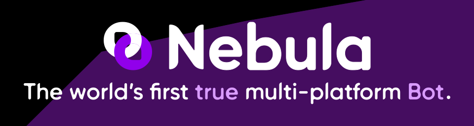

  

    
  

  

    
    
  

# About
Nebula is a multiplatform, multipurpose bot with the ability to add extensions to have additional features.

**Please note that Nebula is currently in an alpha preview state and only usable within Discord with limited functionality.**

# Contributing
While we're developing the multiplatform version of the bot, you can still [help us](CONTRIBUTING.MD) if you find any bugs.

Only bug fixes are accepted, **no new features!**
